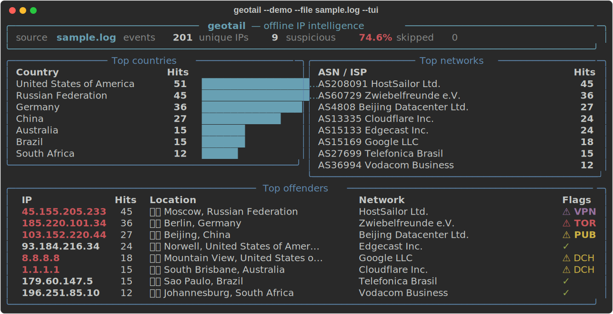
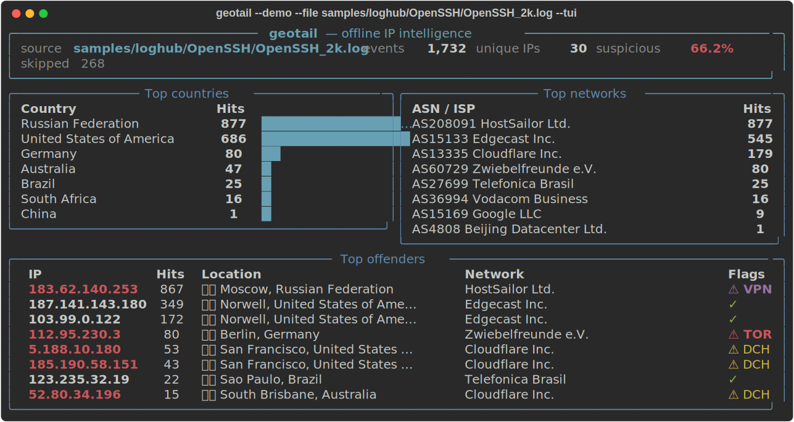
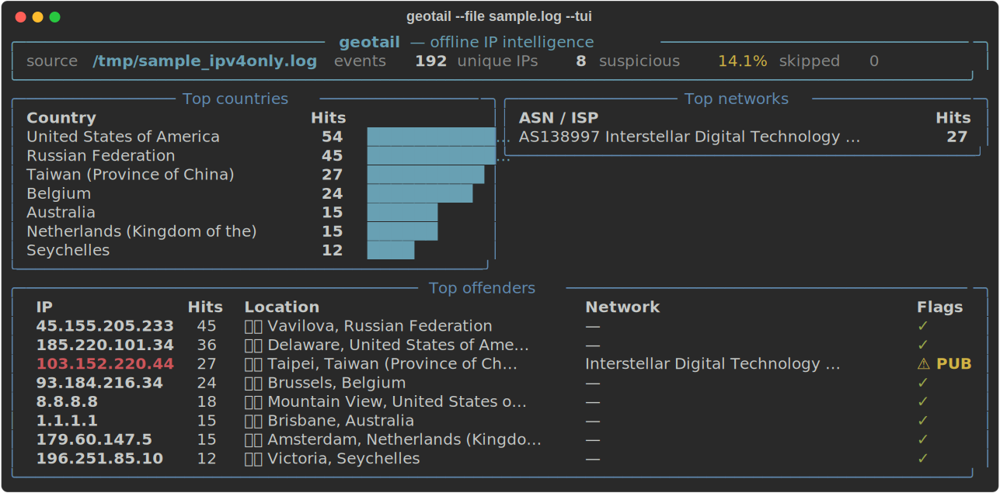

# geotail

**Pipe your server logs in, get a live map of who's knocking — fully offline.**

`geotail` reads server logs, enriches every source IP with geolocation and proxy/VPN/Tor
intelligence from local [IP2Location LITE](https://lite.ip2location.com) databases, and renders a
live terminal dashboard of where traffic comes from and how much of it is suspicious. No API keys,
no network calls, no data leaving your box.



*`geotail --demo --file sample.log --tui` — top countries, top networks, and a top-offenders
table with TOR/VPN/proxy flags, updating live as lines arrive.*

## 30-second quickstart

```bash
pipx install geotail   # or: pip install geotail / uvx geotail
geotail --demo         # live dashboard, zero external files needed
```

For real lookups, download two free LITE databases from
**<https://lite.ip2location.com>** (free account, no credit card, attribution required):

1. `IP2LOCATION-LITE-DB11.BIN` — geolocation (required)
2. `IP2PROXY-LITE-PX11.BIN` — proxy/VPN/Tor detection (optional but recommended)

Drop both into `./data/`. If you have a download token instead (account → Download on the LITE
site), fetch them directly:

```bash
curl -sSL -o db11.zip "https://www.ip2location.com/download/?token=$IP2LOCATION_DOWNLOAD_TOKEN&file=DB11LITEBIN"
curl -sSL -o px11.zip "https://www.ip2location.com/download/?token=$IP2LOCATION_DOWNLOAD_TOKEN&file=PX11LITEBIN"
unzip -o db11.zip IP2LOCATION-LITE-DB11.BIN -d data/
unzip -o px11.zip IP2PROXY-LITE-PX11.BIN -d data/
```

Then run:

```bash
geotail --file sample.log            # bundled sample traffic
tail -f /var/log/nginx/access.log | geotail
geotail --file auth.log --json > enriched.jsonl
geotail --file sample.log --report report.html
```

> **Note:** IP2Proxy LITE covers public proxies; the commercial database adds
> VPN/Tor/datacenter/residential classification for richer results. geotail reads whatever fields
> your BIN tier provides and quietly omits the rest — a country-only DB works fine too.

## Features

- **Offline-first** — every lookup comes from local BIN files; zero network calls in the
  enrichment path.
- **Live TUI dashboard** — top countries, top networks (ASN/ISP), and a top-offenders table with
  proxy/VPN/Tor flags, streaming as lines arrive.
- **Log-format aware** — auto-detects nginx/apache combined, sshd/auth.log, and a generic
  first-IP fallback; or force with `--format` / bring your own `--regex`.
- **JSONL mode** — `--json` emits one enriched record per line for jq/SIEM pipelines
  (automatically the default when stdout is piped).
- **HTML report** — `--report out.html` writes a self-contained page with a Leaflet world map and
  summary tables.
- **tail -f built in** — `--file x.log --follow` keeps reading as the file grows, and survives
  logrotate truncation.
- **IPv4 + IPv6**, LRU-cached lookups, graceful handling of private/invalid IPs, clean Ctrl-C.
- **Demo mode** — `--demo` runs on bundled deterministic fake data, so you can try everything
  before downloading a single database.

## Demo script

A walkthrough for presenting `geotail` live. Everything except step 6 runs in `--demo` mode
(bundled synthetic data), so nothing beyond this repo is required.

### 1. The hook

```bash
geotail --demo --file sample.log --tui
```

No API keys, no BIN downloads — nothing to explain before the payoff. Let it sit a few seconds:
top countries, top networks, and a top-offenders table with TOR/VPN/proxy flags in red. Ctrl-C to
stop.

### 2. Real-world log formats

```bash
geotail --demo --file samples/loghub/OpenSSH/OpenSSH_2k.log --tui
```



*1,732 of 1,999 lines parsed from a real leaked SSH auth log (the [loghub](https://github.com/logpai/loghub)
research dataset — see [Sample data](#sample-data) to fetch it) — a brute-force IP jumps straight
to the top of "Top offenders," flagged VPN.*

`Linux/Linux_2k.log` from the same dataset also works well (~62% extraction); `Apache/Apache_2k.log`
won't — it's an error log with no client IPs.

### 3. Prove it's a real tailer, not a toy

```bash
tail -f sample.log | geotail --demo
```

Or simulate live traffic:

```bash
while true; do shuf -n1 sample.log; sleep 0.3; done | geotail --demo
```

Sells "pipe your logs in" — the exact pitch at the top of this README.

### 4. JSONL for the SIEM/jq crowd

```bash
geotail --demo --file sample.log --json | jq 'select(.is_proxy)'
```

### 5. The leave-behind artifact

```bash
geotail --demo --file sample.log --report demo_report.html && open demo_report.html
```

A self-contained HTML page with a Leaflet world map and summary tables — good for a follow-up
email or a second screen.

### 6. Real data, if someone asks "is this staged?"

```bash
geotail --file sample.log --tui
```



*Same `sample.log`, real DB11/PX11 lookups instead of `--demo` — real IPs resolve to their real
ASN/city, and the Top networks panel is sparser since LITE DB11 doesn't carry ASN/ISP (the
commercial tier does).*

> **Note:** an IPv6 address looked up against the IPv4-only LITE DB11 simply comes back as
> `unknown` — the library's `"IPV6 ADDRESS MISSING IN IPV4 BIN"` sentinel is normalized away like
> any other missing field. Grab the IPv6-inclusive BIN from the LITE site if you want IPv6
> geolocation.

**Suggested flow:** 1 → 2 → 3 → 4, ending on 5 as the takeaway. Bring in 6 only if someone
questions whether the data is real.

## CLI reference

```
geotail [SOURCE] [OPTIONS]

Sources (default: stdin):
  SOURCE / --file PATH    read from a file instead of stdin

Options:
  --format {auto,nginx,apache,sshd,generic}   log format (default: auto)
  --regex PATTERN         custom IP-extraction regex (implies generic)
  --geo-db PATH           IP2Location BIN (else $IP2LOCATION_DB, else ./data/)
  --proxy-db PATH         IP2Proxy BIN (else $IP2PROXY_DB, else ./data/; optional)
  --json                  emit enriched JSONL instead of the TUI
  --tui                   force the live dashboard even when piped
  --report PATH           write a static HTML report on exit
  --follow                keep reading as the file grows (tail -f)
  --top N                 rows in top-N panels (default 10)
  --demo                  run against bundled fake data, no BIN needed
  --about                 print version + IP2Location attribution
```

The TUI is the default when stdout is a terminal; JSONL is the default when piped. `--json` and
`--tui` force one or the other (and are mutually exclusive).

### Example JSONL record

```json
{"ip": "185.220.101.34", "country_code": "DE", "country_name": "Germany", "region": "Berlin",
 "city": "Berlin", "latitude": 52.52, "longitude": 13.405, "asn": "AS60729",
 "isp": "Zwiebelfreunde e.V.", "is_proxy": true, "proxy_type": "TOR", "usage_type": "DCH",
 "ts": "2026-07-15T10:00:07+00:00"}
```

Fields the loaded database doesn't carry are `null` — never an error.

## How it works

```
log lines ──▶ parsers.py ──▶ engine.Enricher ──▶ stats.StatsCollector ──▶ tui / JSONL / report
              (nginx, sshd,       │  LRU cache
               generic, regex)    ▼
                        GeoProvider + ProxyProvider   (typing.Protocol seam)
                        ├─ ip2location.py  ← local IP2Location / IP2Proxy BIN files
                        └─ fake.py         ← deterministic in-memory data (--demo, tests)
```

The enrichment engine only knows about two tiny `Protocol`s (`GeoProvider`, `ProxyProvider`), each
with a single `lookup(ip) -> dict` method. The real implementations wrap the official
[IP2Location](https://pypi.org/project/IP2Location/) and
[IP2Proxy](https://pypi.org/project/IP2Proxy/) libraries reading local BIN files; the fake
implementation powers `--demo` and the entire test suite, which runs with no network and no
proprietary data. Library sentinel values ("NOT SUPPORTED", "This parameter is unavailable…") are
normalized to `None`, so any LITE tier — country-only through DB11/PX11 — works unchanged.

Use it as a library, too:

```python
from geotail import Enricher
from geotail.providers.ip2location import IP2LocationGeoProvider, IP2ProxyProvider

enricher = Enricher(
    IP2LocationGeoProvider("data/IP2LOCATION-LITE-DB11.BIN"),
    IP2ProxyProvider("data/IP2PROXY-LITE-PX11.BIN"),
)
record = enricher.enrich("8.8.8.8")
print(record.country_name, record.is_proxy, record.to_dict())
```

## Sample data

`sample.log` (bundled in this repo, MIT-licensed like the rest of it) is enough to run every
command above except step 2 of the demo script. That step additionally uses the
[loghub](https://github.com/logpai/loghub) research dataset — a collection of real-world system
logs (OpenSSH, Linux, Apache, HDFS, and more) maintained by the LogPAI group.

loghub's data is **not bundled in this repo**: its license permits use for research/academic work
only and requires attribution on redistribution (see [Attribution](#attribution) below), so
`samples/` is gitignored here rather than shipped. Fetch it yourself if you want that demo step:

```bash
git clone --depth 1 https://github.com/logpai/loghub samples/loghub
```

Then point geotail at any of its `*_2k.log` files, e.g. `samples/loghub/OpenSSH/OpenSSH_2k.log`
(the small 2k-line samples loghub hosts directly on GitHub — the full datasets, up to tens of GB,
are on [Zenodo](https://doi.org/10.5281/zenodo.1144100)).

## Development

```bash
pip install -e '.[dev]'
pytest          # 100+ tests, no network, no BIN files needed
mypy            # strict
ruff check src tests scripts
```

Integration tests against real BIN files are marked `integration` and skip automatically when no
database is present in `./data/`.

## Attribution

> geotail uses the IP2Location LITE database for [IP geolocation](https://lite.ip2location.com).

This is the exact acknowledgment IP2Location's LITE license requires (see the `LICENSE_LITE.TXT`
included in each database download) — displayed in the app itself via `geotail --about` and in
every `--report` HTML footer, not just here.

If you use the `samples/loghub/` dataset (see [Sample data](#sample-data) above), loghub's license
asks that you cite it:

```bibtex
@inproceedings{Loghub,
  author    = {Jieming Zhu and Shilin He and Pinjia He and Jinyang Liu and Michael R. Lyu},
  title     = {Loghub: A Large Collection of System Log Datasets for AI-driven Log Analytics},
  booktitle = {IEEE International Symposium on Software Reliability Engineering (ISSRE)},
  year      = {2023}
}
```

## License & contributing

MIT — see [LICENSE](LICENSE). Issues and pull requests welcome; please keep the test suite green
(`pytest`, `mypy`, `ruff`) and add tests alongside any new module.
